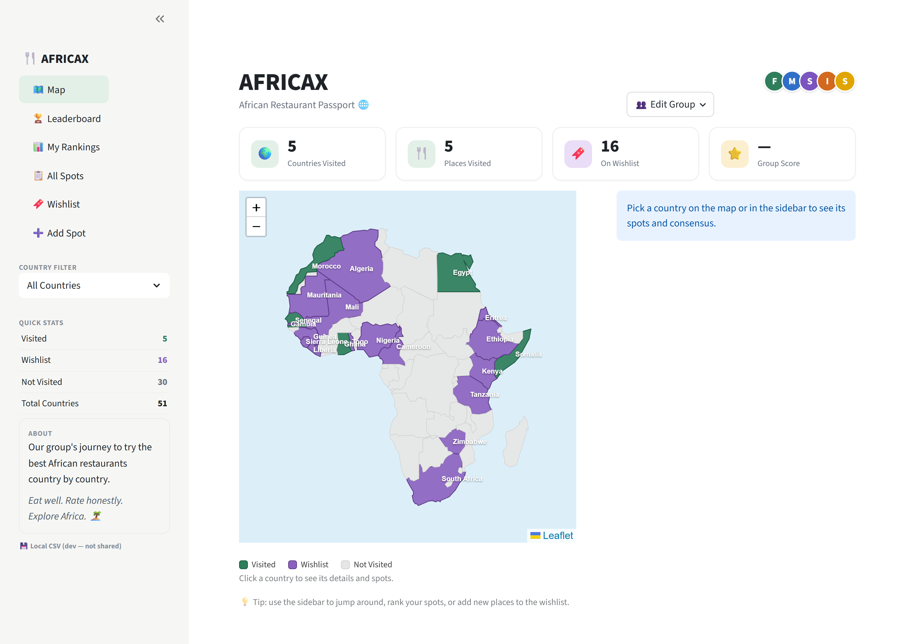
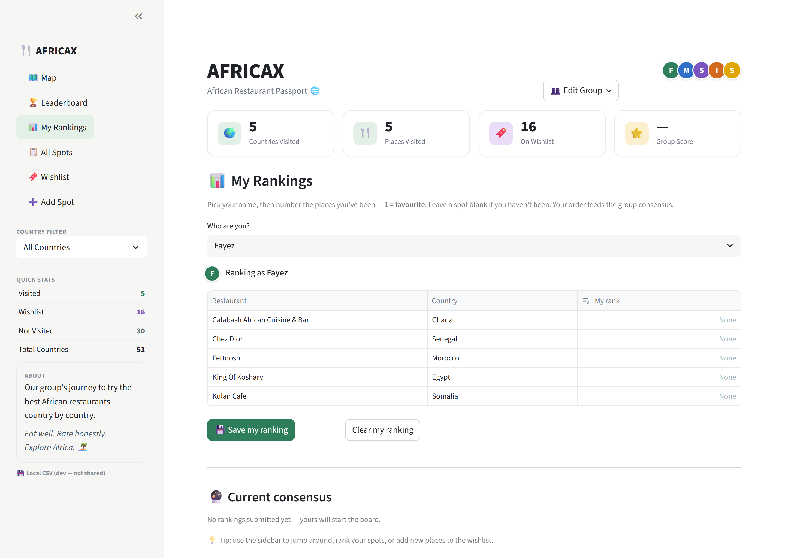
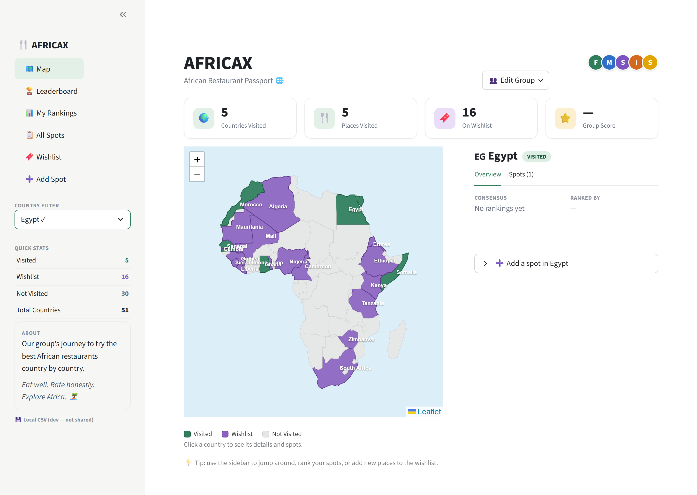
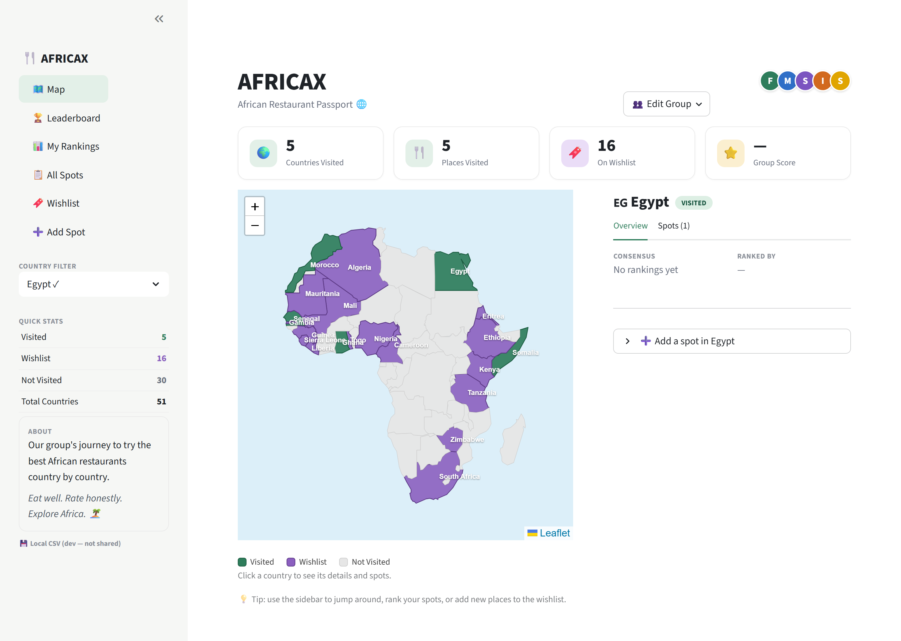
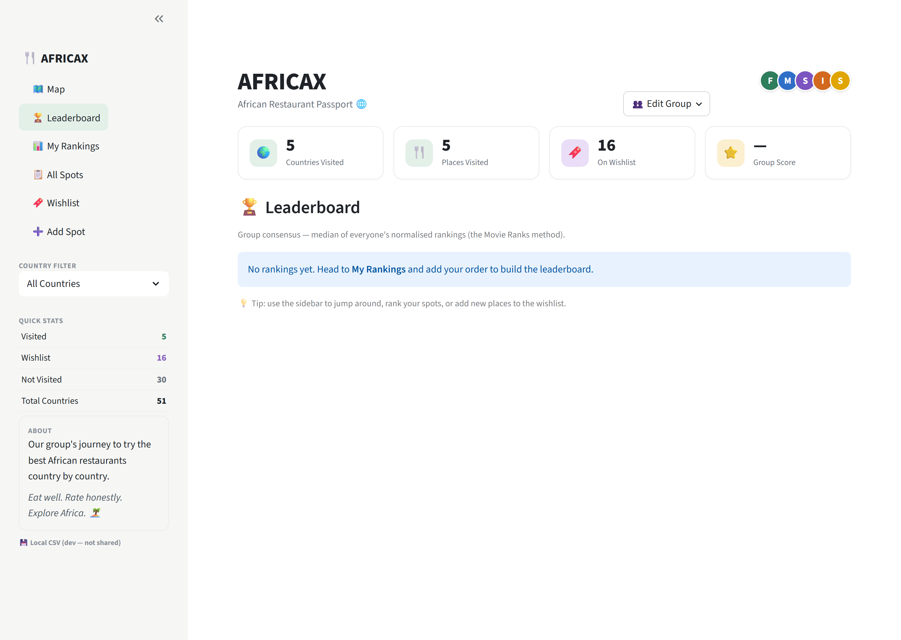
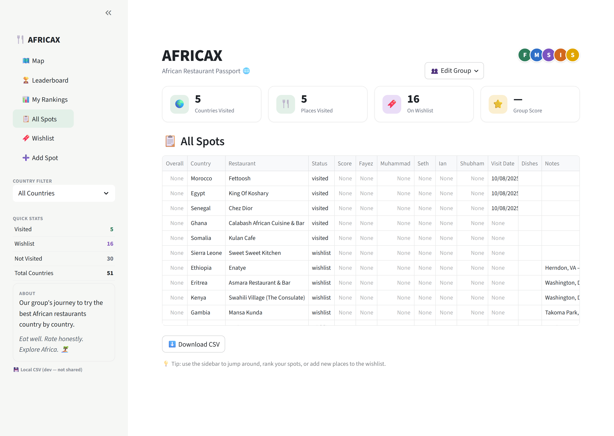
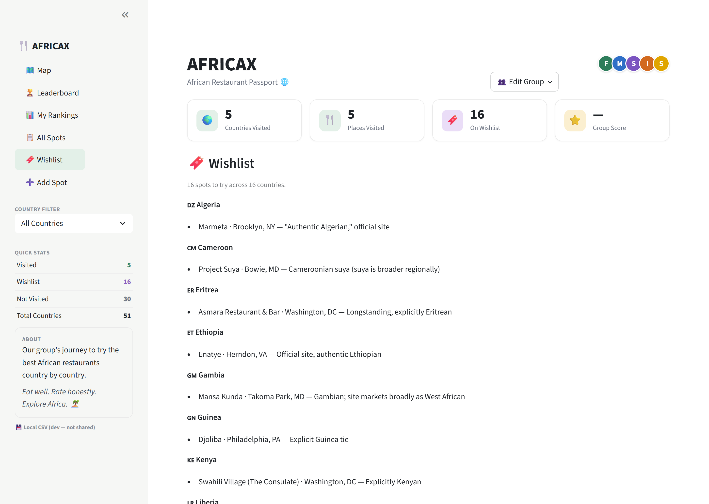
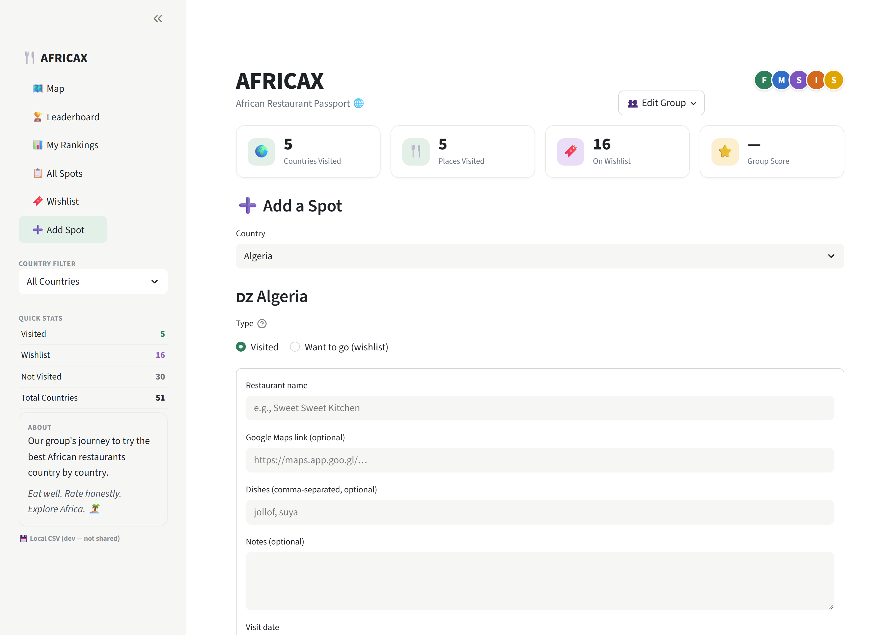

# AfricaX — Design & Engineering Handoff

**For:** claude.ai/design (and anyone picking up the redesign)
**Live app:** https://africaxfoodmap.streamlit.app/
**Repo:** https://github.com/Zeyafb/AfricaX (branch `main`, auto-deploys to Streamlit Cloud on push)
**Prepared:** 2026-06-30

> Attach to the design tool alongside this doc: (1) the **target mockup** image, and
> (2) live screenshots grabbed from the URL above (Map, My Rankings, Leaderboard).

---

## 0. ⚠️ READ THIS FIRST — persistence (now fixed in code; needs a 5-min setup)

> **STATUS (2026-06-30):** A **Google Sheets backend is now implemented.**
> `data_store.py` auto-uses a shared Google Sheet when credentials are present, and
> falls back to the local CSV otherwise. To switch it on, the group does a one-time
> ~5-minute setup — see **[docs/SHEETS_SETUP.md](SHEETS_SETUP.md)**. The sidebar shows
> which backend is live ("💾 Saved to Google Sheets" vs "💾 Local CSV (dev)").
> **Until those secrets are added on Streamlit Cloud, the live app still runs on the
> ephemeral CSV and will NOT persist rankings.** The rest of this section is the *why*.

The stated goal is: *"everyone goes to the URL, updates their rankings, and it's
saved and actually logged."* **The original CSV-only architecture could not do this.**

- The app stores everything in a local file, `data/restaurants.csv`.
- It's deployed on **Streamlit Community Cloud**, which has an **ephemeral
  filesystem**. File writes survive only until the container restarts.
- The container restarts on: any `git push` (redeploy), the free-tier **inactivity
  sleep**, platform reboots, or resource recycling — i.e. constantly.
- On restart the filesystem is rebuilt from GitHub, so **every ranking entered
  through the app is reverted to the committed CSV and lost.**

**Nothing entered on the live site is durably saved today.** It may *look* like it
works during one session (writes are visible until the container recycles), which
makes this a silent data-loss trap. Fixing persistence (Section 5) is prerequisite
to the whole point of the app. Everything else below is secondary to this.

---

## 1. Product overview

A private "restaurant passport" for a group of five friends
(**Fayez, Muhammad, Seth, Ian, Shubham**) working through African cuisines country
by country. You click a country on a map of Africa, see where you've been and what
you thought, bookmark places you want to try, and — the core loop — **rank** the
places you've been so the group gets a consensus "best of."

- **Stack:** Python · Streamlit · Folium (Leaflet) map · GeoPandas · pandas
- **Hosting:** Streamlit Community Cloud (single container, free tier)
- **Data:** one CSV today (`data/restaurants.csv`); no accounts, no login
- **Current data:** 5 visited countries, 16 wishlist countries, 51 total on the map

---

## 2. Current design

The UI is a dashboard: fixed left **sidebar nav** + a main area with a header,
a KPI row, and one of six pages. The visual language: white cards, a green accent
(`#2E7D5B`), soft grey borders, coloured member avatars.

### Target mockup (the north star)
The redesign target is the attached mockup: sidebar nav, four KPI cards, a
green/purple/grey Africa map with a light-blue ocean and country labels, and a
right-hand **country detail panel** with tabs (Overview / Spots), a group score,
member avatars, notes, and dish chips. The current build already implements this
layout; the redesign is about polishing it and closing the gaps in Section 6.

### Screenshots (current build, `docs/screenshots/`)









*Captured from the running app at 1440×1024. The "Local CSV (dev)" badge appears
because these are from a local dev instance; production shows "Saved to Google Sheets".*

### Page-by-page (current build)

**① Map (landing)** — the hero.
```
┌────────────┬──────────────────────────────────────────────────────┐
│ 🍴 AFRICAX │  AFRICAX                              [F][M][S][I][S]  │
│            │  African Restaurant Passport 🌐          [Edit Group] │
│ 🗺 Map      │ ┌───────┐┌───────┐┌───────┐┌───────┐                 │
│ 🏆 Leader.. │ │🌍  5  ││🍴  5  ││🔖 16  ││⭐  —  │                 │
│ 📊 MyRank.. │ │Countr ││Places ││Wishl. ││Group  │                 │
│ 📋 AllSpots│ └───────┘└───────┘└───────┘└───────┘                 │
│ 🔖 Wishlist│ ┌──────────────────────┐┌──────────────────────────┐ │
│ ➕ AddSpot │ │  Africa map:         ││ 🇩🇿 Algeria   WANT TO GO  │ │
│            │ │  green = visited     ││ [Overview] [Spots (1)]    │ │
│ COUNTRY    │ │  purple = wishlist   ││ Want to go                │ │
│ FILTER     │ │  grey = not visited  ││  Marmeta  WANT TO GO      │ │
│ [Algeria▼] │ │  blue ocean, labels  ││  Brooklyn, NY — "Authentic│ │
│            │ │  +/- zoom            ││  Algerian," official site │ │
│ QUICK STATS│ │                      ││  → Spots tab to mark      │ │
│ Visited  5 │ │                      ││    visited/edit           │ │
│ Wishlist16 │ └──────────────────────┘│ + Add a spot in Algeria   │ │
│ NotVis  30 │  ● Visited ● Wishlist   └──────────────────────────┘ │
│ Total   51 │  ● Not Visited                                        │
│ [ABOUT]    │  Click a country to see its details and spots.        │
└────────────┴──────────────────────────────────────────────────────┘
```

**② Leaderboard** — group consensus table (overall #, restaurant, country,
score /10, how many ranked it, which members), plus "each person's #1". Empty
until people rank.

**③ My Rankings** — *the core input page (see Section 4).* Pick your name → a table
of every visited spot with a "My rank" number field (1 = favourite) → Save. Shows a
live consensus preview below.
```
📊 My Rankings
Who are you? [Fayez ▼]      [F] Ranking as Fayez
┌───────────────────────────┬─────────┬─────────┐
│ Restaurant                │ Country │ My rank │
│ Calabash African Cuisine  │ Ghana   │ [    ]  │
│ Chez Dior                 │ Senegal │ [    ]  │
│ Fettoosh                  │ Morocco │ [    ]  │
│ King Of Koshary           │ Egypt   │ [    ]  │
│ Kulan Cafe                │ Somalia │ [    ]  │
└───────────────────────────┴─────────┴─────────┘
[💾 Save my ranking]  [Clear my ranking]
🔮 Current consensus  → #, Restaurant, Country, Score
```

**④ All Spots** — full sortable table (overall rank, country, restaurant, status,
score, each member's rank, date, dishes, notes, maps link) + Download CSV.

**⑤ Wishlist** — the 16 "want to go" spots grouped by country, with maps links.

**⑥ Add Spot** — pick a country, add a visited or wishlist place (name, maps link,
dishes, notes, date). No scores here — ranking happens on My Rankings.

### Design tokens (as built)
| Token | Value |
|---|---|
| Accent / primary green | `#2E7D5B` (visited fill; borders `#1C5C41`) |
| Wishlist purple | `#8B5FBF` (border `#5E3B87`) |
| Not-visited grey | `#E6E6E6` (border `#CFCFCF`) |
| Ocean | `#DCEFF9` |
| Text / muted | `#1F2328` / `#6B7280` / `#8A8F98` |
| Cards | white, 1px `#EAEAEA`, radius 14px, soft shadow |
| KPI icon tints | green `#E3F0E8`, purple `#EADDF7`, gold `#FBEFD0` |
| Member avatars | F `#2E7D5B` · M `#2F6FC7` · S `#7B54C0` · I `#D2691E` · S `#E0A500` |
| Pills | VISITED `#DDEFE4`/`#12513A` · WANT TO GO `#EADDF7`/`#5E3B87` |
| Chips (dishes) | bg `#EEF3EF`, text `#2E5A44` |
| Type | system sans-serif; title 2.4rem/800; KPI number 1.7rem/800 |

---

## 3. Functionality (what works today)

- Clickable Folium choropleth of Africa; click or sidebar filter selects a country.
- Three map states with permanent labels + a light-blue ocean.
- KPI cards, member-avatar header, sidebar quick-stats + About card.
- Country detail panel with Overview / Spots tabs; add/edit/delete spots; mark a
  wishlist spot as visited.
- **My Rankings**: each member submits an ordered ranking; saved to the CSV.
- **Consensus leaderboard** computed live from everyone's rankings.
- All-spots table with CSV download; wishlist view.
- 18 passing tests (data layer + consensus math); validated with Streamlit AppTest.

---

## 4. Rankings — how the scoring works

There are **no 1–10 star ratings.** Standing is by **consensus ranking**, ported
from the group's Movie Ranks project (`rankings.py`):

1. Each member puts the places they've been in **order**, favourite first.
2. Each rank becomes a **0–100 percentile within that member's own list**:
   `100 × (size − rank) / (size − 1)`. So everyone's #1 = 100, last = 0, and a list
   of 3 compares fairly against a list of 20.
3. A restaurant's score = the **median** of those percentiles (median, so one
   contrarian can't sink a group favourite).
4. Sort by median → **overall rank**. **Coverage** = how many members ranked it.
5. For a familiar read, the median is shown as an **X/10 star** (median ÷ 10).

**Data schema** (`data/restaurants.csv`, canonical order):
`Country, ISO_A3, Restaurant, Fayez, Muhammad, Seth, Ian, Shubham, Visit Date,
Notes, Dishes, Status, Maps_URL`
- Per-member columns hold that member's **rank** (1 = favourite; blank = not ranked).
- No `Group_Rating` column — consensus is computed on the fly.
- `Status` ∈ {`visited`, `wishlist`}.

---

## 5. Persistence & "Sheets" — the architecture decision

### History (important context)
AfricaX was **originally on Google Sheets** (gspread + a service-account key). A
prior cleanup **backed it out to a local CSV** because Sheets "added complexity and
introduced a secret." **That was the right call for a local, single-user app** — but
the requirements have changed: it's now a **multi-user cloud app that must persist
writes.** On Streamlit Cloud a local CSV can't do that (Section 0). So the tradeoff
flips — we need a hosted store again.

### Options
| Option | How | Pros | Cons |
|---|---|---|---|
| **A. Google Sheets** (recommended) | `data_store` reads/writes a Sheet via a service account (gspread or `st-gsheets-connection`); creds in Streamlit **secrets** | Group already has the Google project (`africax-485504`); proven for exactly this; human-readable, editable by hand; free | Must re-provision a service-account key (old one was deleted/should be revoked); API rate limits; needs a write-lock strategy for concurrent saves |
| **B. Supabase / Postgres** (free tier) | Real DB; `data_store` swaps to SQL | Concurrency, integrity, scales | New account; more infra than 5 users need |
| **C. Commit-back to GitHub** | App writes CSV then commits via API | Keeps single-file model; versioned | Hacky; each save triggers a redeploy (disruptive); token in secrets; races |
| **D. Do nothing** | Keep local CSV | Simplest | **Fails the core requirement — data is lost.** Not viable. |

### Recommendation
**Option A — Google Sheets. ✅ IMPLEMENTED (2026-06-30).** `data_store.py` now
auto-detects a service account + sheet URL (Streamlit secrets or env vars) and uses
the Sheet as the source of truth, falling back to the CSV locally. The public API
(`load` / `save` / `set_ranking` / `append_row` / …) is unchanged, so **the UI didn't
change**; an empty Sheet **auto-seeds** from the committed CSV on first load. Setup is
one ~5-minute task per **[docs/SHEETS_SETUP.md](SHEETS_SETUP.md)**; verify with
`verify_sheets.py`. Remaining hardening: whole-sheet saves are last-write-wins — fine
for five friends, but a cell-level update would remove the small concurrent-save race.

### Identity gap (related)
There is **no login** — "Who are you?" is an honour-system dropdown, so anyone can
overwrite anyone's ranking, and there's no audit of who changed what. For a trusted
group of five this may be acceptable, but the designer/PM should decide whether to
add lightweight identity (a name+PIN, a shared passphrase, or per-person links).

---

## 6. Gaps

1. **Persistence (critical, blocks the goal).** See Sections 0 & 5.
2. **Concurrency.** Even with a hosted store, simultaneous saves need a
   read-modify-write guard; the CSV path has none.
3. **Identity / auth.** No login; the member picker is unenforced.
4. **Empty state.** With no rankings yet, Leaderboard and "Group Score" show "—".
   Needs friendly first-run guidance ("Be the first to rank!").
5. **Mobile.** The sidebar + two-column map/detail layout is desktop-first; Streamlit
   collapses awkwardly on phones. Most people will open this on a phone.
6. **Map interaction.** Folium is an iframe — clicks trigger a full Streamlit rerun
   (a beat of latency); labels can crowd at low zoom.
7. **No edit history / undo.** Overwrites are silent and unversioned.
8. **Accessibility.** Colour + text labels are good, but the custom CSS nav relies on
   `:has()`, avatar colours aren't all AA-contrast on white, and the data-editor is
   fiddly with a keyboard.
9. **Ranking UX.** Numeric "type a rank" is clunky vs. drag-to-order; no guard rails
   for a member who's only tried 2 places.
10. **Add-vs-rank split.** Adding a visited spot and ranking it are two separate
    pages — mildly confusing.

---

## 7. Pros (what's good — keep it)

- **Principled scoring** — median-of-percentiles consensus is fair and already
  trusted by the group (shared with Movie Ranks).
- **Clean, modular code** — `data_store` (data), `rankings` (math), `mapview` (map),
  `ui` (widgets), `app` (routing). Storage can be swapped without touching the UI.
- **Tested** — 18 unit tests + an AppTest render pass across all pages.
- **Solid visual direction** — the mockup layout is genuinely nice and mostly built.
- **Accessible-minded** — map states carry text labels, not colour alone.
- **No secrets today** — nothing sensitive committed (a plus to preserve when Sheets
  comes back: creds go in Streamlit secrets, never the repo).

## 8. Cons (constraints to design around)

- **Streamlit ceilings** — limited control over layout/interactivity; heavy custom
  CSS is brittle across Streamlit versions; every interaction is a full rerun.
- **Ephemeral hosting** — the free tier sleeps and recycles; persistence must be
  external.
- **Folium coupling** — the map is an iframe; rich hover/click UX is constrained.
- **Single-file data model** — simple, but no concurrency or history.

---

## 9. Design brief for claude.ai/design

Redesign goals, in priority order:
1. **Make "rank your spots" the obvious primary action** on landing (especially on
   mobile) — this is the app's reason to exist.
2. **Mobile-first** layout that still feels like the desktop mockup.
3. **Great empty state** that invites the first ranking.
4. Keep the **passport/map delight** (green/purple/grey Africa, avatars, chips).
5. Surface **consensus** clearly — overall rank + X/10 + who ranked it.
6. Design a **first-class ranking interaction** (drag-to-order preferred).
7. Reflect **identity** if the group wants it (who's ranking, whose #1).

Reusable inputs: the design tokens (§2), the six pages (§2), the ranking model (§4).
Constraint: it will be built in Streamlit — favour card/stack/tab patterns over
bespoke drag-canvas UI unless a custom component is justified.

---

## 10. Recommended next steps (engineering)

1. **Persistence → Google Sheets.** ✅ implemented in `data_store.py`; the group just
   does the one-time credential setup (docs/SHEETS_SETUP.md) to switch it on.
2. Add a **concurrency-safe save** (cell-level update) — optional hardening.
3. Add a **friendly empty state** + a landing nudge to rank.
4. **Mobile pass** on the layout.
5. Decide on **identity** (name+PIN or shared passphrase) if desired.
6. Then hand the polished flows to design for the visual refresh.

## 11. Open decisions (need the group's input)

- **Persistence backend:** Google Sheets (recommended) vs. Supabase vs. other?
- **Identity:** honour-system dropdown (today) vs. per-person PIN/passphrase?
- **Ranking input:** keep numeric, or invest in drag-to-order?
- **Scope of the design pass:** full visual redesign, or polish the current mockup?
